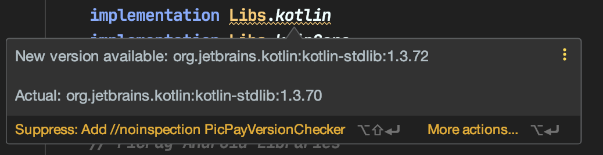

# Version Checker Gradle Lint 
[](https://androidweekly.net/issues/issue-436)

Warning on new versions available even when using Kotlin-DSL plugin.



This detector checks with a central repository to see if there are newer versions available for the dependencies used by your project.
This is similar to the `GradleDependency` check, which checks for newer versions available. This works with any Google, MavenCentral, JCenter, or Jitpack dependency, and connects to the remote library if the reference does not exist in the local cache. The cache lifetime default is 60 minutes but can be modified in `versionlint.properties` into `buildSrc` module.

## Install

Run script [install.sh](https://github.com/PicPay/version-checker-gradle-lint/blob/master/install.sh):
> bash install.sh

Or [copy manually](https://github.com/PicPay/version-checker-gradle-lint/releases/latest) `version-checker.jar` to `$HOME/.android/lint/`

## Configuration: _buildSrc/versionlint.properties_:

#### Default values
```
versionlint.cache.time.minutes=60
versionlint.prerelease.enable=false
versionlint.versions.file=Versions
versionlint.dependencies.suffix=Libs
```

- Cache
> `versionlint.cache.time.minutes=60`

- Versions file name:
> `versionlint.versions.file=Versions`

- Suffix for libraries declaration files:
> `versionlint.dependencies.suffix=Libs`

You can create files with this suffix. 
> Examples: `Libs`, `AndroidLibs`, `TestLibs`, etc.

- Enables find release candidates (alpha, beta, rc):
> `versionlint.prerelease.enable=false`


## Create your _version_ file
```kotlin
object Versions {

    val kotlinVersion = "1.3.70"
   
    val junit4Version = "4.12"
}
```
## Create libraries files
```kotlin
object Libs {

    val kotlin = "org.jetbrains.kotlin:kotlin-stdlib:${Versions.kotlinVersion}"
}
```

```kotlin
object TestLibs {

    val junit4 = "junit:junit:${Versions.junit4Version}"
}
```

```kotlin
object OtherLibs {

    val myLib = "mylib:mylib:${Versions.myLib}"
}
```

## Enable/Disable lint with `lintOptions` (default: `enabled`)
```groovy
lintOptions {
    enable "VersionCheckerGradleLint"
}
```

## License
```
MIT License

Copyright (c) 2020 PicPay

Permission is hereby granted, free of charge, to any person obtaining a copy
of this software and associated documentation files (the "Software"), to deal
in the Software without restriction, including without limitation the rights
to use, copy, modify, merge, publish, distribute, sublicense, and/or sell
copies of the Software, and to permit persons to whom the Software is
furnished to do so, subject to the following conditions:

The above copyright notice and this permission notice shall be included in all
copies or substantial portions of the Software.

THE SOFTWARE IS PROVIDED "AS IS", WITHOUT WARRANTY OF ANY KIND, EXPRESS OR
IMPLIED, INCLUDING BUT NOT LIMITED TO THE WARRANTIES OF MERCHANTABILITY,
FITNESS FOR A PARTICULAR PURPOSE AND NONINFRINGEMENT. IN NO EVENT SHALL THE
AUTHORS OR COPYRIGHT HOLDERS BE LIABLE FOR ANY CLAIM, DAMAGES OR OTHER
LIABILITY, WHETHER IN AN ACTION OF CONTRACT, TORT OR OTHERWISE, ARISING FROM,
OUT OF OR IN CONNECTION WITH THE SOFTWARE OR THE USE OR OTHER DEALINGS IN THE
SOFTWARE.
```
